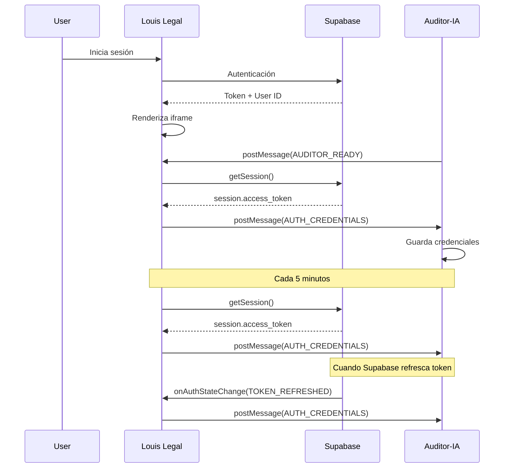

# Integración Louis Legal → Auditor-IA

## 🎯 Objetivo

Asegurar que Auditor-IA siempre use el token de autenticación actual del usuario logueado en Louis Legal, evitando errores 401 por tokens expirados.

## ⚠️ Problema Actual

- ❌ Auditor-IA tiene un token hardcodeado en `.env` que puede expirar
- ❌ El token del `.env` es de desarrollo y no refleja al usuario actual
- ✅ La solución: Louis Legal debe enviar el token actual via `postMessage`

## 🔧 Implementación en Louis Legal

### 1. Componente del Iframe

En el componente de Louis Legal que carga Auditor-IA:

```typescript
'use client';

import { useEffect, useRef } from 'react';
import { createClient } from '@/lib/supabase/client';

export function AuditorIAFrame() {
  const iframeRef = useRef<HTMLIFrameElement>(null);
  const supabase = createClient();

  useEffect(() => {
    let intervalId: NodeJS.Timeout;

    // Función para enviar credenciales actuales
    const sendCredentials = async () => {
      try {
        // Obtener sesión actual de Supabase
        const { data: { session }, error } = await supabase.auth.getSession();

        if (error) {
          console.error('❌ Error al obtener sesión:', error);
          return;
        }

        if (!session?.access_token) {
          console.warn('⚠️ No hay sesión activa');
          return;
        }

        // Enviar credenciales al iframe
        const credentials = {
          type: 'AUTH_CREDENTIALS',
          token: session.access_token,
          userId: session.user.id,
          email: session.user.email,
          timestamp: Date.now(),
        };

        console.log('📤 Enviando credenciales a Auditor-IA:', {
          userId: session.user.id,
          email: session.user.email,
          tokenExpiry: new Date(session.expires_at! * 1000).toISOString(),
        });

        iframeRef.current?.contentWindow?.postMessage(
          credentials,
          process.env.NEXT_PUBLIC_AUDITOR_URL || 'http://localhost:3000'
        );
      } catch (error) {
        console.error('❌ Error al enviar credenciales:', error);
      }
    };

    // Listener para cuando Auditor-IA esté listo
    const handleAuditorReady = (event: MessageEvent) => {
      // Validar origen
      const allowedOrigins = [
        'https://auditor-ia.vercel.app',
        'http://localhost:3000', // Auditor-IA en desarrollo
        'http://localhost:3001',
        process.env.NEXT_PUBLIC_AUDITOR_URL,
      ].filter(Boolean);

      if (!allowedOrigins.includes(event.origin)) {
        return;
      }

      if (event.data?.type === 'AUDITOR_READY') {
        console.log('✅ Auditor-IA está listo, enviando credenciales iniciales');
        sendCredentials();
      }

      // Auditor-IA solicita autenticación
      if (event.data?.type === 'AUTH_REQUIRED') {
        console.log('🔑 Auditor-IA solicita autenticación, enviando credenciales');
        sendCredentials();
      }
    };

    window.addEventListener('message', handleAuditorReady);

    // Enviar credenciales cada 5 minutos para mantener sincronizado
    // (Supabase refresca el token automáticamente cada hora)
    intervalId = setInterval(() => {
      console.log('🔄 Refrescando credenciales de Auditor-IA');
      sendCredentials();
    }, 5 * 60 * 1000); // 5 minutos

    // Enviar credenciales iniciales después de un delay
    // (para asegurar que el iframe haya cargado)
    setTimeout(sendCredentials, 1000);

    // Cleanup
    return () => {
      window.removeEventListener('message', handleAuditorReady);
      clearInterval(intervalId);
    };
  }, [supabase]);

  return (
    <iframe
      ref={iframeRef}
      src={process.env.NEXT_PUBLIC_AUDITOR_URL || 'http://localhost:3000'}
      className="w-full h-full border-0"
      title="Auditor IA"
      allow="clipboard-read; clipboard-write"
      sandbox="allow-same-origin allow-scripts allow-forms allow-popups allow-downloads"
    />
  );
}
```

### 2. Variables de Entorno en Louis Legal

Agregar en `.env.local`:

```bash
# Ambiente de Pruebas (Local)
NEXT_PUBLIC_AUDITOR_URL=http://localhost:3000

# Producción (descomentar cuando se suba a Vercel)
# NEXT_PUBLIC_AUDITOR_URL=https://auditor-ia.vercel.app
```

### 3. Listener para Refresh de Token

Supabase refresca el token automáticamente. Agregar listener:

```typescript
useEffect(() => {
  const { data: { subscription } } = supabase.auth.onAuthStateChange(
    async (event, session) => {
      if (event === 'TOKEN_REFRESHED' && session) {
        console.log('🔄 Token de Supabase refrescado, actualizando Auditor-IA');

        iframeRef.current?.contentWindow?.postMessage({
          type: 'AUTH_CREDENTIALS',
          token: session.access_token,
          userId: session.user.id,
          email: session.user.email,
          timestamp: Date.now(),
        }, process.env.NEXT_PUBLIC_AUDITOR_URL);
      }
    }
  );

  return () => {
    subscription.unsubscribe();
  };
}, [supabase]);
```

## 🔄 Flujo Completo



## 🧪 Cómo Probar

### 1. En Louis Legal (DevTools Console):

```javascript
// Ver sesión actual
const { data: { session } } = await supabase.auth.getSession();
console.log('Token actual:', session?.access_token);
console.log('Expira:', new Date(session?.expires_at * 1000));

// Enviar manualmente al iframe
const iframe = document.querySelector('iframe');
iframe?.contentWindow?.postMessage({
  type: 'AUTH_CREDENTIALS',
  token: session.access_token,
  userId: session.user.id,
  email: session.user.email,
  timestamp: Date.now()
}, 'http://localhost:3000'); // URL de Auditor-IA en pruebas
```

### 2. En Auditor-IA (DevTools Console):

```javascript
// Ver credenciales recibidas
console.log('Credenciales actuales:', authService.getCredentials());

// Ver si el token es del .env o dinámico
// Si ves "🔐 Usando credenciales dinámicas" → Correcto
// Si ves "⚙️ Usando credenciales de variables de entorno" → No recibió postMessage
```

### 3. Verificar en Network Tab:

1. Abre DevTools → Network
2. Filtra por API calls
3. Selecciona una petición
4. Verifica el header `Authorization`
5. Copia el token
6. Verifica en [jwt.io](https://jwt.io) que el token NO esté expirado

## 🐛 Troubleshooting

### No recibe credenciales

**Síntoma**: Auditor-IA sigue usando token del `.env`

**Verificar**:
```javascript
// En Louis Legal
console.log('Iframe:', document.querySelector('iframe'));
console.log('ContentWindow:', document.querySelector('iframe')?.contentWindow);

// En Auditor-IA
console.log('Parent:', window.parent);
console.log('Is in iframe:', window.parent !== window);
```

**Solución**: Asegurar que el iframe cargue correctamente y que los orígenes estén permitidos.

### Token sigue expirando

**Síntoma**: Error 401 después de 1 hora

**Verificar**:
```javascript
// En Louis Legal
const { data: { session } } = await supabase.auth.getSession();
console.log('Token expira en:', new Date(session?.expires_at * 1000));
```

**Solución**: Implementar el listener `onAuthStateChange` para TOKEN_REFRESHED.

### CORS errors

**Síntoma**: Blocked by CORS policy

**Solución**:
1. Verificar que Auditor-IA permita el origen de Louis Legal en `ALLOWED_ORIGINS`
2. Verificar que el API Gateway permita el origen de Auditor-IA

## ✅ Checklist de Integración

- [ ] Implementar componente AuditorIAFrame en Louis Legal
- [ ] Agregar NEXT_PUBLIC_AUDITOR_URL en .env
- [ ] Implementar listener AUDITOR_READY
- [ ] Implementar listener AUTH_REQUIRED
- [ ] Implementar envío periódico de credenciales (cada 5 min)
- [ ] Implementar listener onAuthStateChange para TOKEN_REFRESHED
- [ ] Probar en desarrollo local
- [ ] Probar en staging/vercel
- [ ] Verificar en Network tab que headers sean correctos
- [ ] Verificar que tokens no expiren durante sesión activa

## 📝 Notas Importantes

1. **Nunca usar el token del `.env` en producción**: Es solo para desarrollo standalone
2. **Supabase refresca automáticamente**: El token se refresca cada ~50 minutos automáticamente
3. **Sincronización cada 5 min**: Mantiene ambos sistemas sincronizados sin esperar al refresh
4. **Validar origen**: Siempre validar el origen de los mensajes `postMessage` por seguridad

## 🔐 Seguridad

- ✅ Validar origen de mensajes
- ✅ Usar HTTPS en producción
- ✅ No loguear tokens completos
- ✅ Tokens en sessionStorage, no localStorage
- ✅ Limpiar credenciales al cerrar sesión

## 📞 Soporte

Para dudas sobre esta integración, contactar al equipo de desarrollo.
